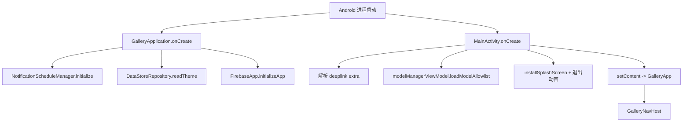
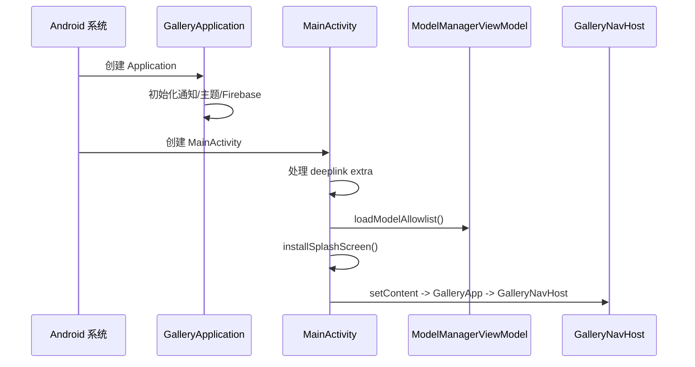
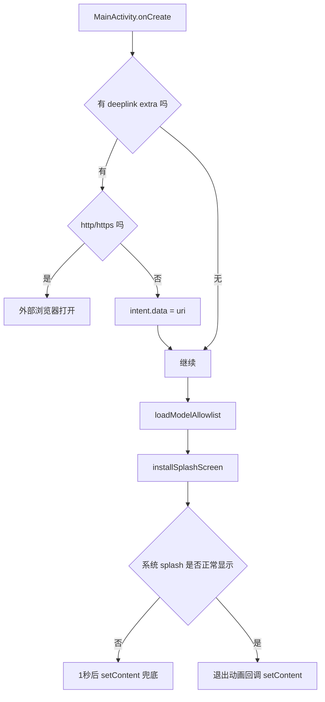

# Android 核心架构 01：启动与应用层

## 这章讲什么

把 App 想成一所学校：

- `GalleryApplication` 是**总务老师**：每天上学先把灯、广播、值班表准备好。
- `MainActivity` 是**校门老师**：同学进门后，决定先去哪里（首页、外部链接、通知跳转）。
- `GalleryApp` 是**走廊入口**：把大家带到真正的教室（导航系统）。

---

## 架构图（谁管谁）

---

## 关键代码细节（函数级，实打实）

## 1) `GalleryApplication.onCreate()`

代码里做了 3 件非常具体的事：

- `notificationScheduleManager.initialize()`  
  含义：把之前保存的通知计划恢复进内存（比如昨天设的提醒）。
- `ThemeSettings.themeOverride.value = dataStoreRepository.readTheme()`  
  含义：读取用户主题（亮色/暗色/自动），避免启动后才突然换主题。
- `FirebaseApp.initializeApp(this)`  
  含义：初始化 Firebase（埋点、推送能力的底座）。

---

## 2) `MainActivity.onCreate()`

### A. 先处理 deeplink

在 `onCreate` 和 `onNewIntent` 里都有同一套逻辑：

- 读 `intent.getStringExtra("deeplink")`
- 如果是 `http/https`：`startActivity(Intent.ACTION_VIEW, link.toUri())`（交给浏览器）
- 否则：`intent.data = link.toUri()`（交给 App 内导航）

这就是为什么从推送点进来时，有的会开浏览器，有的会直接进 App 页。

### B. 立刻启动模型目录加载

- 调用：`modelManagerViewModel.loadModelAllowlist()`
- 含义：尽早把模型列表准备好，首页任务卡和模型页才有内容。

### C. Splash 不是“贴图”，是有时序控制的

`installSplashScreen()` 后，代码做了两层兜底：

1. 如果系统 splash 因系统策略没显示，1 秒后也会调用 `setContent()`；
2. 如果 splash 正常显示，就在 `setOnExitAnimationListener` 里做淡出：
   - 算系统图标动画剩余时间
   - 先挂载主内容
   - 再 alpha 淡出 splash

这样不会黑屏，也不会突然闪白。

### D. 启动后界面与设备行为

- `enableEdgeToEdge()`：内容延伸到状态栏/导航栏区域
- Android Q+：`window.isNavigationBarContrastEnforced = false`
- `FLAG_KEEP_SCREEN_ON`：演示场景下屏幕常亮

---

## 3) `GalleryApp` 很薄，但很关键

`GalleryApp(...)` 只做一件事：

- `GalleryNavHost(navController, modelManagerViewModel)`

好处：入口层不堆业务逻辑，后续改导航时风险小。

---

## 4) `AppModule` 怎么把底层零件接好

`di/AppModule.kt` 用 Hilt 提供单例：

- 5 个 DataStore（settings/user_data/cutouts/benchmark_results/skills）
- `DataStoreRepository`
- `DownloadRepository`
- `AppLifecycleProvider`（实现是 `GalleryLifecycleProvider`）
- `Moshi`

为什么要 `AppLifecycleProvider`？

- 导航层会在前后台切换时调用 `setAppInForeground(...)`
- 下载仓库可以据此判断：App 在前台就少发系统通知，避免打扰。

---

## 流程图（从点图标到看到首页）

---

## 一个真实小例子（通知跳转）

场景：用户点开通知，通知里带了 `deeplink=com.google.ai.edge.gallery://model/llm_chat/Gemma-4-E4B-it`

发生顺序：

1. `MainActivity.onNewIntent` 收到 intent。
2. 发现 `deeplink` 不是 http，写入 `intent.data`。
3. `GalleryNavGraph` 检测到 `intent.data`，解析出 taskId 和 modelName。
4. 导航到 `route_model/{taskId}/{modelName}`。
5. 页面显示对应模型的聊天页。

这不是“概念上会跳转”，而是代码里真的按这 5 步跑。

---

## 深入代码：关键函数拆解表

| 函数 | 在哪里 | 输入 | 输出/副作用 | 失败或特殊分支 |
| --- | --- | --- | --- | --- |
| `GalleryApplication.onCreate()` | `GalleryApplication.kt` | 无 | 初始化通知调度、主题、Firebase | 如果 DataStore 读取慢，会延迟主题应用 |
| `MainActivity.onCreate()` | `MainActivity.kt` | `intent` | 处理 deeplink、触发 allowlist 加载、挂载 Compose | `super.onCreate(null)` 会丢弃系统恢复状态（这是故意行为） |
| `MainActivity.onNewIntent()` | `MainActivity.kt` | 新 `intent` | 更新 `intent.data`，让导航层消费 | deeplink 非法时会导致后续导航分支无法命中 |
| `GalleryApp(...)` | `GalleryApp.kt` | `modelManagerViewModel` | 进入 `GalleryNavHost` | 无复杂分支 |

---

## 深入代码：启动时序的“为什么”

### 1) 为什么 `super.onCreate(null)`？

这句不是笔误。代码注释已写明：  
目的是**不恢复上次被系统杀掉时的页面栈**，强制回到 Home，避免恢复到中间态页面导致状态错乱。

### 2) 为什么 `loadModelAllowlist()` 放在 splash 阶段？

因为首页任务卡和模型列表依赖 allowlist。提前触发可减少“进首页后才开始空转”的等待感。

### 3) 为什么有两条 `setContent()` 路？

- 路 A：1 秒兜底（某些系统版本 splash 会被优化掉）
- 路 B：在 `setOnExitAnimationListener` 里按系统动画节奏切入

两条路最终都受 `contentSet` 保护，保证 Compose 只挂载一次。

---

## 补充流程图：冷启动的分支路径

---

## 排障提示（出问题先看哪里）

1. **通知点进来没跳转**：先看 `MainActivity.onNewIntent` 是否拿到 `deeplink`，再看 `intent.data` 是否被正确赋值。  
2. **启动后白屏时间长**：看 `loadModelAllowlist()` 是否网络阻塞；看 splash 退出回调是否触发。  
3. **主题闪烁**：看 `GalleryApplication.onCreate` 中 `readTheme()` 是否及时执行。  
