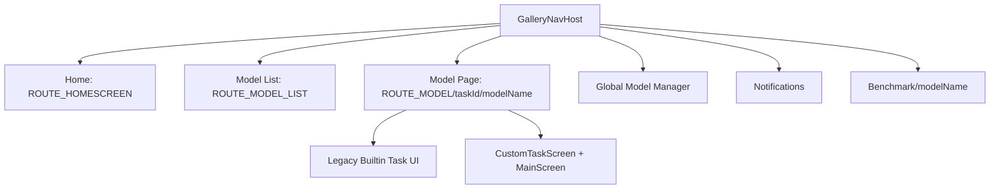
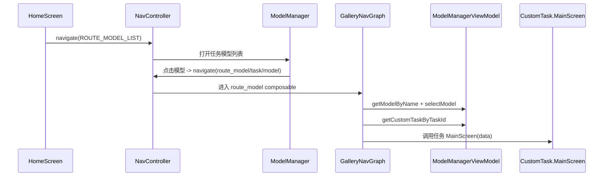
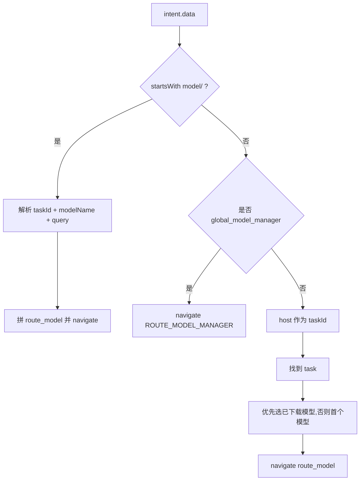

# Android 核心架构 02：导航与页面流

## 这章讲什么

你可以把导航系统想成地铁图：

- 每个页面是一个站点。
- `GalleryNavGraph.kt` 是地铁调度台。
- deeplink 就像“别人给你一张票”，直接把你送到指定站。

---

## 架构图（导航骨架）

---

## 关键代码细节（函数级）

## 1) 路由常量

在 `GalleryNavGraph.kt` 里定义了：

- `ROUTE_HOMESCREEN = "homepage"`
- `ROUTE_MODEL_LIST = "model_list"`
- `ROUTE_MODEL = "route_model"`
- `ROUTE_MODEL_MANAGER = "model_manager"`
- `ROUTE_NOTIFICATIONS = "notifications"`
- `ROUTE_BENCHMARK = "benchmark"`

这不是随便写字符串，后面所有 `navController.navigate(...)` 都依赖这些。

---

## 2) 首页 -> 模型列表

在 `HomeScreen(...)` 的 `navigateToTaskScreen` 回调中：

- 先把 `pickedTask = task`
- 再 `navController.navigate(ROUTE_MODEL_LIST)`

到了 `ROUTE_MODEL_LIST` 的 composable：

- 直接把 `pickedTask` 传给 `ModelManager(...)`
- 点击模型后跳 `"$ROUTE_MODEL/{taskId}/{modelName}"`

---

## 3) 模型页分发（最关键）

`ROUTE_MODEL/{taskId}/{modelName}?query={query}` 到达后，代码做了 4 件事：

1. 通过 `modelManagerViewModel.getModelByName(modelName)` 找到模型。
2. `modelManagerViewModel.selectModel(...)` 设为当前模型。
3. `getCustomTaskByTaskId(taskId)` 找到对应任务实现。
4. 分两条路：
   - `isLegacyTasks(task.id) == true`：走内置页数据结构 `CustomTaskDataForBuiltinTask`
   - 否则：走 `CustomTaskScreen(...)`，并提供 AppBar 控制与自定义返回处理

这里就是“插件任务能进同一导航体系”的关键点。

---

## 4) 深链（deeplink）真实分发规则

导航层会检查 `intent.data`，并且等 `tasks` 加载完成后才处理。

支持 3 类 URI：

1. 精确模型：
   - `com.google.ai.edge.gallery://model/<taskId>/<modelName>`
2. 全局模型管理：
   - `com.google.ai.edge.gallery://global_model_manager`
3. 任务级：
   - `com.google.ai.edge.gallery://<taskId>`
   - 自动挑该任务里“已下载优先”的模型跳转

---

## 5) 动画是怎么做的（不是默认）

文件里定义了专门动画函数：

- `slideEnter()` / `slideExit()`
- `slideUpEnter()` / `slideDownExit()`

并根据“从哪个页面来、要去哪个页面”决定是否套动画。  
例如 Home -> ModelList 用左右滑，Home -> Notifications 用上下滑。

---

## 流程图（从首页点模型，到进入聊天页）

---

## 一个真实小例子（推送带 query）

如果 deeplink 是：

`com.google.ai.edge.gallery://model/llm_chat/Gemma-4-E4B-it?query=Explain+CPU+vs+GPU`

代码会：

1. 解析 `taskId=llm_chat`、`modelName=Gemma-4-E4B-it`、`query=...`
2. 拼路由时用 `Uri.encode(queryStr)`
3. 进入模型页后把这个 query 传给内置任务页
4. 任务页再把它作为初始消息发给模型

所以“带 query 的一键问答”是有完整代码链路的。

---

## 深入代码：路由参数契约（必须匹配）

`route_model` 在代码中声明了 3 个参数：

- `taskId: String`（必填）
- `modelName: String`（必填）
- `query: String?`（可选，默认 null）

如果你拼路由时漏了 `taskId/modelName` 任一项，`getModelByName(...)` 或 `getCustomTaskByTaskId(...)` 会直接拿不到对象，页面无法正确渲染。

---

## 深入代码：关键函数拆解表

| 函数/片段 | 在哪里 | 关键输入 | 关键行为 | 失败分支 |
| --- | --- | --- | --- | --- |
| `GalleryNavHost(...)` | `GalleryNavGraph.kt` | `navController`, `modelManagerViewModel` | 注册全部路由与动画 | 若 `pickedTask==null`，`model_list` 页不显示内容 |
| `composable(route=ROUTE_MODEL_LIST)` | `GalleryNavGraph.kt` | `pickedTask` | 渲染任务内模型列表 | `pickedTask` 丢失会导致空页 |
| `composable(route="$ROUTE_MODEL/{taskId}/{modelName}?query={query}")` | `GalleryNavGraph.kt` | taskId/modelName/query | 选择模型 + 分发到 CustomTask UI | modelName 无效时直接不进入任务 UI |
| deeplink 处理块（`intent.data`） | `GalleryNavGraph.kt` | URI | 解析三种 deeplink 并导航 | malformed URI 只打日志，不崩溃 |

---

## 深入代码：返回与清理逻辑

在普通 custom task 路径里，`onNavigateUp` 不只是 `navigateUp()`：

1. 先恢复动画控制变量（避免回退动画异常）。
2. 清空 `lastNavigatedModelName`。
3. 遍历当前 task 的所有 model，逐个 `cleanupModel(...)`。

这一步很重要：避免模型实例泄漏到下一次进入。

---

## 补充流程图：deeplink 分发决策树

---

## 排障提示（最常见）

1. **deeplink 有值但不跳转**：检查 `modelManagerUiState.tasks.isNotEmpty()` 条件是否满足（任务未加载时不会处理）。  
2. **回退后模型仍占内存**：检查普通 custom task 分支的 `cleanupModel(...)` 是否执行。  
3. **同模型重复初始化**：看 `lastNavigatedModelName` 比较逻辑是否被绕过。  
