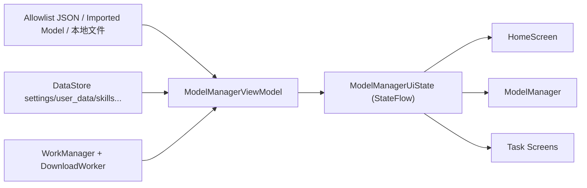
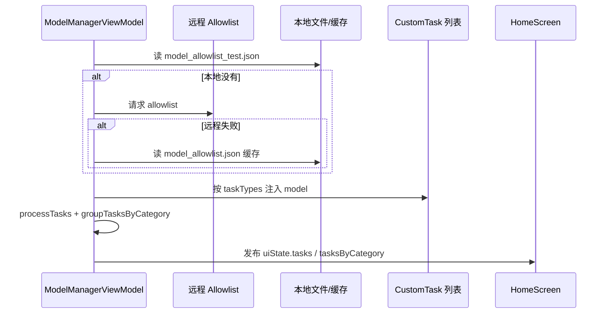
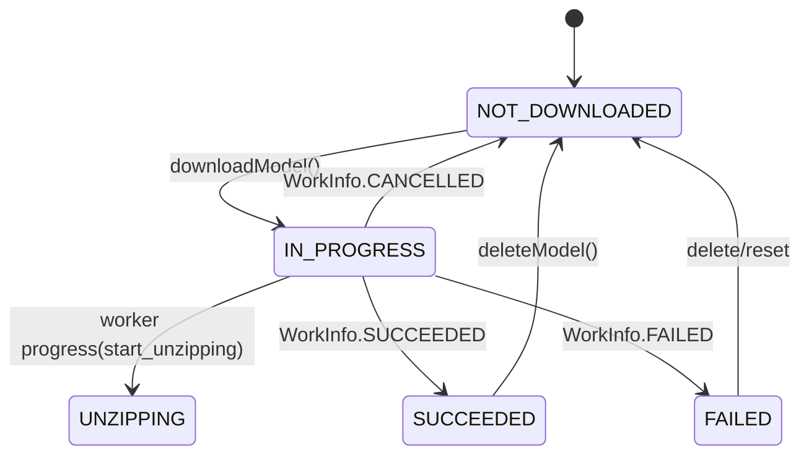
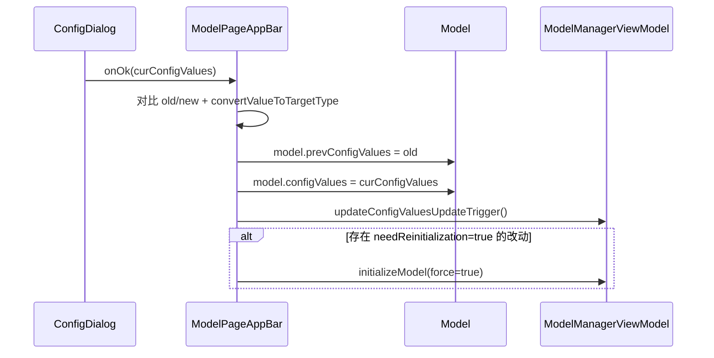

# Android 核心架构 03：数据与状态层

## 这章讲什么

这一层像“图书馆管理员 + 仓库管理员”：

- 图书馆管理员：把数据分门别类存好（DataStore）。
- 仓库管理员：负责模型下载、续传、失败重试（DownloadRepository + Worker）。
- 总登记员：把“现在系统是什么状态”统一发布给页面（ModelManagerViewModel）。

---

## 架构图（数据从哪里来，去哪里）

---

## 关键代码细节（函数级）

## 1) `Model` 数据结构是如何描述模型的

`Model.kt` 里的 `data class Model` 不是只有名字，它包含了完整运行信息：

- 下载信息：`url`、`downloadFileName`、`version`、`extraDataFiles`
- 运行信息：`runtimeType`、`accelerators`、`capabilities`
- 本地路径策略：`localFileRelativeDirPathOverride`、`localModelFilePathOverride`
- 运行态：`instance`、`initializing`、`cleanUpAfterInit`

关键方法：

- `preProcess()`：初始化默认配置值 + 计算 `totalBytes`
- `getPath(context, fileName)`：统一计算模型文件路径（导入模型、下载模型、zip 解压路径都在这里处理）

---

## 2) `Config` 如何把“参数”变成 UI 可编辑项

`Config.kt` 里定义了：

- `ConfigEditorType`（滑杆、开关、分段按钮等）
- `ValueType`（INT/FLOAT/STRING/BOOLEAN）
- `createLlmChatConfigs(...)`、`createAICoreConfigs(...)`

意思是：模型参数不是散乱变量，而是“可生成 UI 的结构化配置”。

---

## 3) `DataStoreRepository` 统一持久化入口

`DefaultDataStoreRepository` 把大量数据操作收拢在一处，例如：

- `saveTheme` / `readTheme`
- `saveAccessTokenData` / `readAccessTokenData`
- `saveImportedModels` / `readImportedModels`
- `addSkill` / `setSkillSelected` / `deleteSkill`
- `addBenchmarkResult` / `getAllBenchmarkResults`

对应 proto 结构可追到：

- `settings.proto` 的 `Settings`
- `settings.proto` 的 `UserData`
- `chat_history.proto` 的 `ChatSessionProto`

---

## 4) `ModelManagerViewModel` 是状态总闸门

`ModelManagerUiState` 里最重要的字段：

- `tasks`
- `tasksByCategory`
- `modelDownloadStatus`
- `modelInitializationStatus`
- `selectedModel`

关键函数：

- `loadModelAllowlist()`：加载 allowlist（本地 test -> 网络 -> 本地缓存）
- `createUiState()`：合并 allowlist 模型 + 导入模型 + 历史输入
- `downloadModel(...)`：分发到 AICore 下载或 WorkManager 下载
- `initializeModel(...)`：统一初始化入口（内部调用 `CustomTask.initializeModelFn`）
- `cleanupModel(...)`：释放实例并回写状态
- `setDownloadStatus(...)`：下载状态写入 `_uiState`

---

## 5) 下载仓储的实逻辑

`DownloadRepository.downloadModel(...)` 做了非常实在的事情：

1. 用 `Data.Builder` 写入下载参数（url、modelName、extraData URL 等）。
2. 创建 `OneTimeWorkRequest<DownloadWorker>`。
3. `enqueueUniqueWork(model.name, REPLACE, workRequest)`。
4. 监听 `WorkInfo` 状态并映射到：
   - `IN_PROGRESS`
   - `UNZIPPING`
   - `SUCCEEDED`
   - `FAILED` / `NOT_DOWNLOADED`

下载成功/失败后还会触发通知和埋点事件。

---

## 流程图（加载模型清单到首页展示）

---

## 一个真实小例子（导入模型后为什么马上能看到）

函数：`addImportedLlmModel(info: ImportedModel)`

它做了这些“真动作”：

1. 用 `createModelFromImportedModelInfo` 生成 `Model`。
2. 把这个模型按能力加进多个任务：
   - `llm_chat`
   - `llm_prompt_lab`
   - `llm_agent_chat`
   - 若支持图片，再加到 `llm_ask_image` 等
3. 更新 `modelDownloadStatus` 和 `modelInitializationStatus`。
4. 保存到 DataStore 的 `imported_model` 列表。

结果：UI 立刻能看到，不用重启 App。

---

## 深入代码：`ModelManagerUiState` 字段意义（高频）

| 字段 | 含义 | 谁更新它 | 页面谁在用 |
| --- | --- | --- | --- |
| `tasks` | 当前可用任务列表 | `loadModelAllowlist/createUiState` | Home、导航分发 |
| `tasksByCategory` | 按分类分组后的任务 | `groupTasksByCategory` | Home tab + pager |
| `modelDownloadStatus` | 每个模型下载状态 | `setDownloadStatus` | 模型列表、下载按钮 |
| `modelInitializationStatus` | 每个模型初始化状态 | `updateModelInitializationStatus` | 聊天页可发送状态判断 |
| `selectedModel` | 当前选中的模型 | `selectModel` | 任务页、配置页 |

---

## 深入代码：allowlist 加载分支矩阵

| 步骤 | 数据源 | 成功后动作 | 失败后动作 |
| --- | --- | --- | --- |
| 1 | `/data/local/tmp/model_allowlist_test.json` | 解析并使用 | 进入步骤 2 |
| 2 | 远程 `ALLOWLIST_BASE_URL/version.json` | 保存到本地缓存并使用 | 进入步骤 3 |
| 3 | 本地缓存 `externalFilesDir/model_allowlist.json` | 解析并使用 | `loadingModelAllowlistError` 置为失败 |

补充：`loadModelAllowlist()` 里还会过滤：

- `disabled == true` 的模型
- 设备不支持 AICore 的模型
- NPU-only 且不匹配当前 SOC 的模型

---

## 深入代码：下载状态机（ViewModel 视角）

对应代码点：

- `DownloadRepository.observerWorkerProgress(...)`
- `ModelManagerViewModel.setDownloadStatus(...)`

---

## 深入代码：初始化状态机（模型实例）

核心判定在：

- `initializeModel(...)`
- `cleanupModel(...)`
- `updateModelInitializationStatus(...)`

关键保护逻辑：

1. 已初始化且非强制初始化 -> 直接跳过。
2. 正在初始化时再请求清理 -> 置 `cleanUpAfterInit = true`，等 init 完成后再清理。
3. stale cleanup（旧 instance）会被拒绝，避免新实例被误杀。

---

## 深入代码：配置加载（不是一句话，按代码逐步走）

这里的“配置加载”其实有 **3 层来源**，最终都会落在 `model.configValues`：

1. **allowlist 默认配置层**：`AllowedModel.defaultConfig`（`topK/topP/temperature/maxTokens/accelerators`）  
2. **模型配置结构层**：`AllowedModel.toModel()` 里调用 `createLlmChatConfigs/createAICoreConfigs` 生成 `configs`（每项带 `valueType`、`needReinitialization`）  
3. **运行时当前值层**：`Model.preProcess()` 把每个 `config.defaultValue` 写进 `model.configValues`

关键代码链路（真实函数）：

1. `ModelManagerViewModel.loadModelAllowlist()` 读到 JSON 后，遍历 `allowedModel`。  
2. `allowedModel.toModel()` 把 JSON 字段转换成 `Model + List<Config>`。  
3. `task.models.add(model)` 后执行 `processTasks()`，每个 model 都会 `preProcess()`。  
4. `preProcess()` 把默认值落到 `model.configValues[key.label]`。  

所以首次进入页面时，UI 看到的参数值不是“临时写死”，而是从 allowlist 真正变换过来的。

---

## 深入代码：配置修改后如何生效（ConfigDialog 到重初始化）

配置修改不是“改个数字就完了”，链路是：

关键细节（`ModelPageAppBar.kt`）：

- 会逐项比较 `modelConfigs`，不是盲目重初始化。  
- 只有改动项里存在 `needReinitialization=true` 才会 `initializeModel(force=true)`。  
- `model.prevConfigValues` 会保留，方便任务侧做差异处理。  

---

## 深入代码：模型下载全链路（ViewModel -> Repository -> Worker）

### A. 入口分支（`ModelManagerViewModel.downloadModel`）

1. 先把 UI 状态改成 `IN_PROGRESS`。  
2. 若 `runtimeType == AICORE`：走 `AICoreModelHelper.downloadModel(...)`（不走 WorkManager）。  
3. 否则：先 `deleteModel(removeImportedFromModelList=false)` 清理旧文件，再走 `downloadRepository.downloadModel(...)`。  

### B. Repository 做的事（`DefaultDownloadRepository.downloadModel`）

1. 用 `Data.Builder` 写入 worker 参数（重点 key）：  
   - `KEY_MODEL_URL`  
   - `KEY_MODEL_DOWNLOAD_FILE_NAME`  
   - `KEY_MODEL_COMMIT_HASH`  
   - `KEY_MODEL_EXTRA_DATA_URLS`  
   - `KEY_MODEL_TOTAL_BYTES`  
   - `KEY_MODEL_DOWNLOAD_ACCESS_TOKEN`  
2. 创建 `OneTimeWorkRequestBuilder<DownloadWorker>()`。  
3. `enqueueUniqueWork(model.name, ExistingWorkPolicy.REPLACE, request)`：同模型新任务会替换旧任务。  
4. `observerWorkerProgress(...)` 把 `WorkInfo` 映射回 UI 状态。  

### C. Worker 实际下载细节（`DownloadWorker.doWork`）

1. 立即 `setForeground(createForegroundInfo(...))`，避免后台被系统杀。  
2. 下载主模型 + `extraDataFiles`（串行）。  
3. 如果存在 `*.tmp`：  
   - 设置 `Range: bytes=<tmpSize>-`  
   - 设置 `Accept-Encoding: identity`  
   - 读取 `Content-Range` 计算续传起点。  
4. 每 200ms 上报一次进度（`receivedBytes/downloadRate/remainingMs`）。  
5. 下载完把 `xxx.tmp` rename 成正式文件。  
6. 若 `isZip=true`：上报 `KEY_MODEL_START_UNZIPPING=true`，解压到 `unzippedDir`，再删除 zip。  
7. IOException 时 `Result.failure(outputData[KEY_MODEL_DOWNLOAD_ERROR_MESSAGE])`。  

---

## 深入代码：下载状态映射（WorkInfo -> UI）

| WorkInfo.State | UI 状态 | 额外行为 |
| --- | --- | --- |
| `ENQUEUED` | （准备态） | 记录下载开始时间、埋点 start |
| `RUNNING` + `start_unzipping=false` | `IN_PROGRESS` | 回传 bytes/rate/remaining |
| `RUNNING` + `start_unzipping=true` | `UNZIPPING` | 显示解压状态 |
| `SUCCEEDED` | `SUCCEEDED` | 发送成功通知、埋点 success |
| `FAILED` | `FAILED` | 回传 errorMessage、埋点 failure |
| `CANCELLED` | `NOT_DOWNLOADED` | 清理状态 |

---

## 深入代码：模型加载（初始化）完整链路

`ModelManagerViewModel.initializeModel(...)` 不是简单“调用一下 helper”，它有一套防并发和防误清理逻辑：

1. **已初始化且非 force** -> 直接跳过。  
2. **正在初始化** -> 跳过并重置 `cleanUpAfterInit=false`。  
3. 调 `cleanupModel(...)` 清理旧实例。  
4. 状态置为 `INITIALIZING`，`model.initializing=true`。  
5. 读取系统提示词：`SystemPromptHelper.getEffectiveSystemPrompt(...)`。  
6. 调 `getCustomTaskByTaskId(task.id)?.initializeModelFn(...)`（真正进入具体 runtime）。  
7. 回调 `onDoneFn(error)`：  
   - `model.instance != null` -> 状态 `INITIALIZED`。  
   - `error.isNotEmpty()` -> 状态 `ERROR`。  
8. 如果 init 期间被请求清理（`cleanUpAfterInit=true`），init 成功后立刻再 cleanup。  

额外关键点：`updateModelInitializationStatus(...)` 会把当前后端（来自 `ConfigKeys.ACCELERATOR`）记入 `initializedBackends`，用于区分同模型不同后端初始化历史。

---

## 排障提示（数据层）

1. **首页没任务**：先看 `loadModelAllowlist()` 是否报错，再看 `loadingModelAllowlistError`。  
2. **下载卡住**：看 `WorkInfo` 是否还在 RUNNING；检查 `DownloadWorker` 是否进入前台通知。  
3. **模型明明下载了却显示未下载**：看 `isModelDownloaded()` 路径计算（特别是 imported/local override 场景）。  
