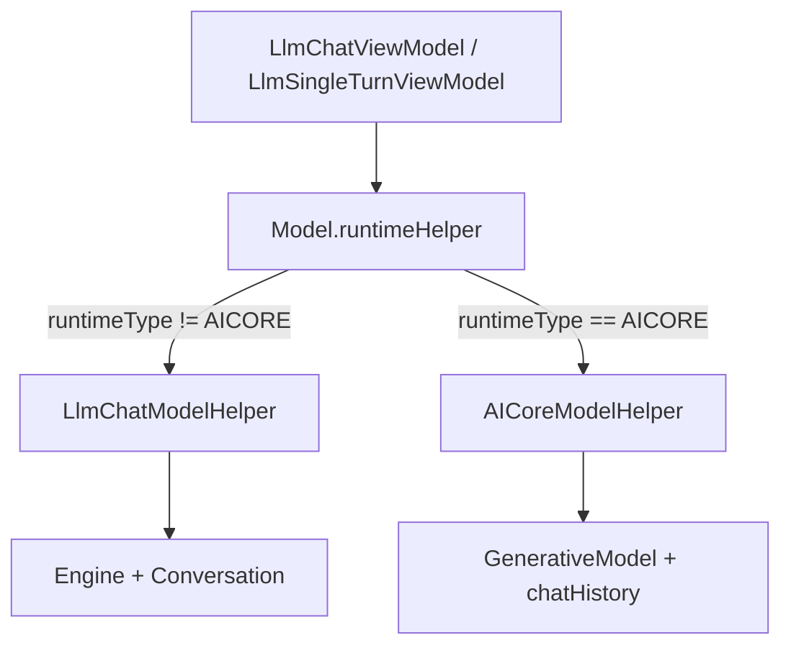
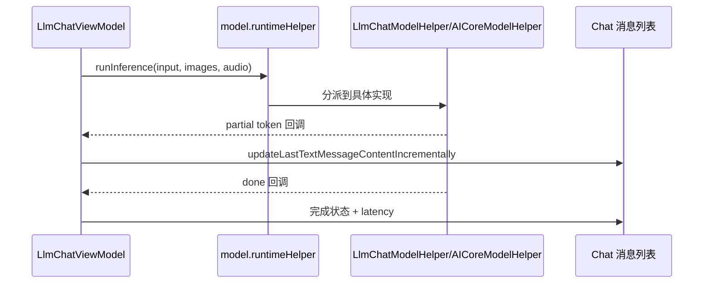
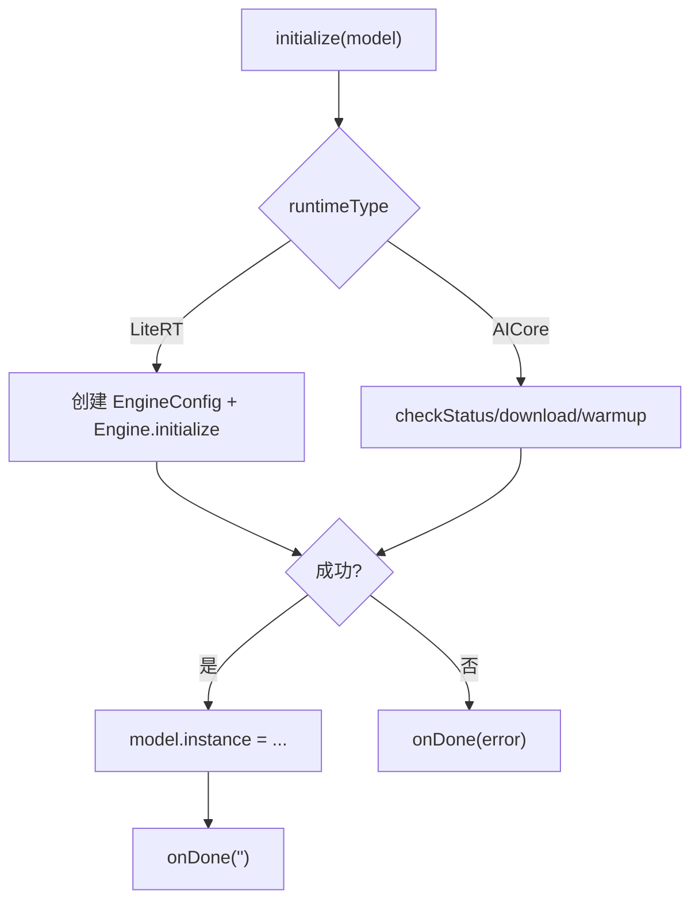

# Android 核心架构 04：推理运行时层

## 这章讲什么

把“模型运行时”想成两台机器：

- 机器 A：`LlmChatModelHelper`（LiteRT-LM）
- 机器 B：`AICoreModelHelper`（ML Kit AICore）

外面的人（页面/ViewModel）不用关心机器内部差别，只要按一个统一按钮：

- 初始化
- 说一句话
- 停止
- 清理

---

## 架构图（统一接口 + 两个后端）



---

## 推理框架体系

### 两大推理框架

| 框架 | 库名 | 版本 | 主类 | 实现类 |
| --- | --- | --- | --- | --- |
| **LiteRT-LM** | `com.google.ai.edge.litertlm` | 0.11.0 | `Engine`、`Conversation` | `LlmChatModelHelper` |
| **MLKit AICore** | `com.google.mlkit:genai-prompt` | 1.0.0-beta2 | `GenerativeModel` | `AICoreModelHelper` |

### 关键导入

```kotlin
// LiteRT-LM
import com.google.ai.edge.litertlm.Engine
import com.google.ai.edge.litertlm.Conversation
import com.google.ai.edge.litertlm.EngineConfig
import com.google.ai.edge.litertlm.ConversationConfig
import com.google.ai.edge.litertlm.Backend
import com.google.ai.edge.litertlm.SamplerConfig
import com.google.ai.edge.litertlm.ToolProvider

// MLKit AICore
import com.google.mlkit.genai.prompt.GenerativeModel
import com.google.mlkit.genai.prompt.generationConfig
import com.google.mlkit.genai.prompt.modelConfig
import com.google.mlkit.genai.prompt.Generation
import com.google.mlkit.genai.common.FeatureStatus
```

---

## 关键代码细节（函数级）

## 1) 统一接口：`LlmModelHelper`（Framework Contract）

完整接口定义（位于 `LlmModelHelper.kt`）：

```kotlin
typealias ResultListener = 
  (partialResult: String, done: Boolean, partialThinkingResult: String?) -> Unit

typealias CleanUpListener = () -> Unit

interface LlmModelHelper {
  /**
   * 初始化推理运行时，支持图像/音频输入、工具调用。
   */
  fun initialize(
    context: Context,
    model: Model,
    taskId: String,
    supportImage: Boolean,
    supportAudio: Boolean,
    onDone: (String) -> Unit,  // 错误消息或成功标记
    systemInstruction: Contents? = null,
    tools: List<ToolProvider> = listOf(),
    enableConversationConstrainedDecoding: Boolean = false,
    coroutineScope: CoroutineScope? = null,
  )

  /**
   * 重置对话历史，保留系统提示词和工具。
   */
  fun resetConversation(
    model: Model,
    supportImage: Boolean = false,
    supportAudio: Boolean = false,
    systemInstruction: Contents? = null,
    tools: List<ToolProvider> = listOf(),
    enableConversationConstrainedDecoding: Boolean = false,
    initialMessages: List<Message> = listOf(),
  )

  /**
   * 执行推理并流式返回结果。
   */
  fun runInference(
    model: Model,
    input: String,
    images: List<Bitmap> = listOf(),
    audio: ByteArray? = null,
    resultListener: ResultListener,
    cleanUpListener: CleanUpListener,
  )

  /**
   * 立即停止正在进行的推理。
   */
  fun stopResponse(model: Model)

  /**
   * 清理模型实例占用的内存和资源。
   */
  fun cleanUp(model: Model, onDone: () -> Unit)
}
```

这 5 个方法就是"运行时契约"。任何新后端都必须实现它。

---

## 2) 动态分派：`Model.runtimeHelper`（Extension Property）

位于 `ModelHelperExt.kt`：

```kotlin
var testingModelHelper: LlmModelHelper? = null  // 用于测试注入

val Model.runtimeHelper: LlmModelHelper
  get() {
    testingModelHelper?.let { return it }  // 测试优先级最高
    if (this.runtimeType == RuntimeType.AICORE) {
      return AICoreModelHelper
    }
    return LlmChatModelHelper
  }
```

**分派规则**：
- 若 `model.runtimeType == RuntimeType.AICORE` → 使用 `AICoreModelHelper`
- 否则 → 使用 `LlmChatModelHelper`

**调用侧代码**无需 if-else，直接写：

```kotlin
model.runtimeHelper.initialize(...)  // 自动分派到正确的后端
```

---

## 3) LiteRT-LM 实现详解（`LlmChatModelHelper`）

### 初始化流程

```kotlin
override fun initialize(
  context: Context,
  model: Model,
  taskId: String,
  supportImage: Boolean,
  supportAudio: Boolean,
  onDone: (String) -> Unit,
  systemInstruction: Contents?,
  tools: List<ToolProvider>,
  enableConversationConstrainedDecoding: Boolean,
  coroutineScope: CoroutineScope?,
) {
  // 步骤 1：读取模型参数（从 model.configValues 取）
  val maxTokens = model.getIntConfigValue(ConfigKeys.MAX_TOKENS, DEFAULT_MAX_TOKEN)
  val topK = model.getIntConfigValue(ConfigKeys.TOPK, DEFAULT_TOPK)
  val topP = model.getFloatConfigValue(ConfigKeys.TOPP, DEFAULT_TOPP)
  val temperature = model.getFloatConfigValue(ConfigKeys.TEMPERATURE, DEFAULT_TEMPERATURE)
  
  // 步骤 2：选择后端（根据加速器类型）
  val accelerator = model.getStringConfigValue(ConfigKeys.ACCELERATOR, Accelerator.GPU.label)
  val preferredBackend = when (accelerator) {
    Accelerator.CPU.label -> Backend.CPU()
    Accelerator.GPU.label -> Backend.GPU()
    Accelerator.NPU.label -> Backend.NPU(context.applicationInfo.nativeLibraryDir)
    Accelerator.TPU.label -> Backend.NPU(context.applicationInfo.nativeLibraryDir)
    else -> Backend.GPU()
  }
  
  // 步骤 3：配置采样器
  val samplerConfig = SamplerConfig(
    topK = topK,
    topP = topP,
    temperature = temperature,
    enableConversationConstrainedDecoding = enableConversationConstrainedDecoding,
  )
  
  // 步骤 4：构建 EngineConfig（包含模型路径、后端、视觉/音频支持）
  val engineConfig = EngineConfig(
    modelPath = model.getPath(context, model.modelName),
    backend = preferredBackend,
    visionBackend = if (shouldEnableImage) visionBackend else null,
    audioBackend = if (shouldEnableAudio) audioBackend else null,
  )
  
  // 步骤 5：初始化 Engine（核心推理引擎）
  val engine = Engine(engineConfig)
  engine.initialize()  // 加载模型权重到内存
  
  // 步骤 6：构建会话配置
  val conversationConfig = ConversationConfig(
    systemInstruction = systemInstruction,
    tools = tools,
    samplerConfig = samplerConfig,
  )
  
  // 步骤 7：创建会话实例并保存
  val conversation = Conversation(engine, conversationConfig)
  model.instance = LlmModelInstance(engine, conversation)
  
  onDone("")  // 成功
}
```

### 推理执行（`runInference`）

```kotlin
override fun runInference(
  model: Model,
  input: String,
  images: List<Bitmap>,
  audio: ByteArray?,
  resultListener: ResultListener,
  cleanUpListener: CleanUpListener,
) {
  val instance = (model.instance as? LlmModelInstance) ?: return
  
  // 转换输入为 LiteRT 格式
  val contents = Contents.Builder()
    .addText(input)
    .apply {
      images.forEach { addImage(it) }
      audio?.let { addAudio(it) }
    }
    .build()
  
  // 发起异步推理
  instance.conversation.sendMessageAsync(
    contents,
    object : MessageCallback {
      override fun onPartialResult(partialResult: String) {
        resultListener(partialResult, done = false, null)
      }
      override fun onComplete(result: String) {
        resultListener("", done = true, null)
        cleanUpListener()
      }
      override fun onError(error: Exception) {
        resultListener("", done = true, null)
        cleanUpListener()
      }
    }
  )
}
```

---

## 4) MLKit AICore 实现详解（`AICoreModelHelper`）

### 初始化流程

```kotlin
override fun initialize(
  context: Context,
  model: Model,
  taskId: String,
  supportImage: Boolean,
  supportAudio: Boolean,
  onDone: (String) -> Unit,
  systemInstruction: Contents?,
  tools: List<ToolProvider>,
  enableConversationConstrainedDecoding: Boolean,
  coroutineScope: CoroutineScope?,
) {
  // AICore 需要 coroutine 上下文
  if (coroutineScope == null) {
    onDone("Initialization failed: CoroutineScope is null")
    return
  }
  
  // 步骤 1：构建 GenerativeModel 配置
  val modelConfig = modelConfig {
    modelName = model.modelId  // 例如 "gemini-2.0-flash"
    modelPreference = ModelPreference.LATEST
    releaseStage = ModelReleaseStage.STABLE
  }
  
  val generationConfig = generationConfig {
    maxOutputTokens = model.getIntConfigValue(ConfigKeys.MAX_OUTPUT_TOKEN, DEFAULT_MAX_OUTPUT_TOKEN)
    topK = model.getIntConfigValue(ConfigKeys.TOPK, DEFAULT_TOPK)
    topP = model.getFloatConfigValue(ConfigKeys.TOPP, DEFAULT_TOPP)
    temperature = model.getFloatConfigValue(ConfigKeys.TEMPERATURE, DEFAULT_TEMPERATURE)
  }
  
  val generativeModel = GenerativeModel(modelConfig, generationConfig)
  
  coroutineScope.launch {
    try {
      // 步骤 2：检查功能可用性
      val status = generativeModel.checkStatus()
      when (status) {
        FeatureStatus.AVAILABLE -> {
          // 步骤 3：Warmup（预热推理引擎）
          generativeModel.warmup()
          
          // 步骤 4：创建会话实例
          model.instance = AICoreModelInstance(
            generativeModel = generativeModel,
            chatHistory = mutableListOf()  // 空白对话历史
          )
          onDone("")  // 成功
        }
        FeatureStatus.DOWNLOADABLE, FeatureStatus.DOWNLOADING -> {
          // 步骤 2b：如果需要下载，监听下载进度
          generativeModel.download().collect { downloadStatus ->
            when (downloadStatus) {
              is DownloadStatus.DownloadStarted -> 
                onDone("Downloading (${downloadStatus.bytesToDownload} bytes)")
              is DownloadStatus.DownloadProgress -> 
                onDone("Progress: ${downloadStatus.byteDownloaded}/${downloadStatus.totalBytes}")
              is DownloadStatus.DownloadCompleted -> {
                generativeModel.warmup()
                model.instance = AICoreModelInstance(generativeModel)
                onDone("")
              }
              is DownloadStatus.DownloadFailed -> 
                onDone("Download failed: ${downloadStatus.exception.message}")
            }
          }
        }
        FeatureStatus.NOT_AVAILABLE -> 
          onDone("Feature not available on this device")
      }
    } catch (e: Exception) {
      onDone("Initialization failed: ${e.message}")
    }
  }
}
```

### 推理执行（`runInference`）

```kotlin
override fun runInference(
  model: Model,
  input: String,
  images: List<Bitmap>,
  audio: ByteArray?,
  resultListener: ResultListener,
  cleanUpListener: CleanUpListener,
) {
  val instance = (model.instance as? AICoreModelInstance) ?: return
  
  // 步骤 1：把新消息加入会话历史
  instance.chatHistory.add(AICoreChatMessage(isUser = true, text = input))
  
  // 步骤 2：构建请求
  val request = generateContentRequest {
    content {
      text(input)
      images.forEach { image(it) }
      audio?.let { audio(it) }
    }
  }
  
  // 步骤 3：流式调用推理，取消旧任务
  instance.inferenceJob?.cancel()
  instance.inferenceJob = viewModelScope.launch {
    try {
      var fullResponse = ""
      generativeModel.generateContentStream(request).collect { response ->
        fullResponse += response.text
        resultListener(response.text, done = false, null)
      }
      
      // 步骤 4：完成后更新会话历史
      instance.chatHistory.add(AICoreChatMessage(isUser = false, text = fullResponse))
      resultListener("", done = true, null)
      cleanUpListener()
    } catch (e: CancellationException) {
      // 用户中断
      cleanUpListener()
    } catch (e: Exception) {
      resultListener("", done = true, null)
      cleanUpListener()
    }
  }
}
```

---

## 5) 典型用法（ViewModel 层）

### 用户点"发送"时

```kotlin
fun generateResponse(userInput: String, selectedModel: Model) {
  // 阶段 1：检查模型是否已初始化
  if (selectedModel.instance == null) {
    _uiState.value = _uiState.value.copy(
      inProgress = true,
      loadingMessage = "Loading model..."
    )
    return
  }
  
  // 阶段 2：执行推理
  _uiState.value = _uiState.value.copy(inProgress = true)
  
  selectedModel.runtimeHelper.runInference(
    model = selectedModel,
    input = userInput,
    images = currentImages,
    resultListener = { partial, done, thinking ->
      if (!done) {
        // 实时更新消息（增量拼接）
        updateLastTextMessageIncrementally(partial)
      } else {
        // 推理完成
        _uiState.value = _uiState.value.copy(inProgress = false)
        // 清理状态
        currentImages.clear()
      }
    },
    cleanUpListener = { /* cleanup */ }
  )
}
```

### 用户点"停止"时

```kotlin
fun stopGenerating(selectedModel: Model) {
  selectedModel.runtimeHelper.stopResponse(selectedModel)
  _uiState.value = _uiState.value.copy(inProgress = false)
}
```

### 模型清理时

```kotlin
fun cleanupModel(selectedModel: Model) {
  selectedModel.runtimeHelper.cleanUp(selectedModel) {
    selectedModel.instance = null
    _uiState.value = _uiState.value.copy(
      modelInitializationStatus = InitStatus.NOT_INITIALIZED
    )
  }
}
```

---

## 5) 调用侧（ViewModel）如何用它

`LlmChatViewModel.generateResponse(...)` 并不关心具体后端，它只做：

1. 等 `model.instance != null`
2. 调 `model.runtimeHelper.runInference(...)`
3. 把 partial token 追加到消息 UI
4. 完成后设 `inProgress = false`

这就是抽象成功的标志：**调用者代码几乎不需要知道后端类型**。

---

## 流程图（一次消息生成）



---

## 一个真实小例子（用户点“停止生成”）

当用户点停止：

1. `LlmChatViewModel.stopResponse(model)` 被调用。
2. 里面调用 `model.runtimeHelper.stopResponse(model)`。
3. 如果是 LiteRT：执行 `conversation.cancelProcess()`。
4. 如果是 AICore：执行 `instance.inferenceJob?.cancel()`。

结果：两个后端都能“马上停”，但上层代码只写一行。

---

## 深入代码：统一接口参数为什么这么多

`initialize(...)` 参数里有：

- `taskId`
- `supportImage`
- `supportAudio`
- `systemInstruction`
- `tools`
- `enableConversationConstrainedDecoding`

原因：运行时层不仅要“生成文本”，还要支持：

1. 多模态（图/音）
2. Function/Tool 调用
3. 不同任务约束（同一模型在不同 task 的行为不同）

---

## 深入代码：LiteRT 与 AICore 的关键差异表

| 维度 | LiteRT (`LlmChatModelHelper`) | AICore (`AICoreModelHelper`) |
| --- | --- | --- |
| 实例类型 | `Engine + Conversation` | `GenerativeModel + chatHistory + inferenceJob` |
| 推理入口 | `conversation.sendMessageAsync` | `generateContentStream` |
| 停止方式 | `conversation.cancelProcess()` | `inferenceJob.cancel()` |
| 会话重置 | 重建 conversation | 清空并重建 chatHistory |
| 下载机制 | 外部 `DownloadWorker` | 内部 `generativeModel.download().collect` |

---

## 深入代码：回调时序（上层为何能流式渲染）

`runInference(...)` 中回调顺序大体是：

1. 多次 `resultListener(partial, done=false, thinking?)`
2. 最后一次 `resultListener("", done=true, null)` 或等效 done 分支

`LlmChatViewModel.generateResponse(...)` 正是利用这个时序做：

- 第一 token 到达 -> 去掉 loading
- 中间 token -> 增量拼接消息
- done -> 固化消息并收尾状态

---

## 补充流程图：初始化失败/成功分支



---

## 排障提示（运行时层）

1. **推理没输出但不报错**：先看 `model.instance` 是否为空，再看回调是否触发 `done=true`。  
2. **AICore 设备不可用**：查看 `checkStatus()` 分支与 `logAICoreAccessDetails(...)` 日志。  
3. **停止不生效**：确认调用的是当前模型实例；模型切换时要避免取消旧实例的 job/conversation。  

---

## 深入代码：模型加载（initialize）参数是怎么被消费的

`ModelManagerViewModel.initializeModel(...)` 传下来的参数，最终在两个后端里消费点不同：

| 参数 | LiteRT 消费点 | AICore 消费点 |
| --- | --- | --- |
| `systemInstruction` | `ConversationConfig.systemInstruction` | 拼接到首轮 prompt/chat history |
| `tools` | `tool(agentTools)` 注入 function call 能力 | 工具能力由上层编排后再进入请求 |
| `supportImage/supportAudio` | EngineConfig 的 vision/audio backend | 请求内容是否包含 image/audio |
| `taskId` | 影响任务级约束与 prompt | 影响构造请求时的策略分支 |
| `enableConversationConstrainedDecoding` | LiteRT 约束解码开关 | AICore 不同实现路径下的解码控制 |

---

## 深入代码：LiteRT initialize 真正执行的步骤

1. 读取 `model.getPath(...)` 定位模型文件。  
2. 从 `model.configValues` 读取 `maxTokens/topK/topP/temperature/accelerator`。  
3. 构建 `EngineConfig`（文本、视觉、音频 backend 组合）。  
4. `Engine.initialize()`，失败会通过 onDone/error 路径冒泡。  
5. 构建 `ConversationConfig(systemInstruction, samplerConfig, tools)`。  
6. `model.instance = LlmModelInstance(engine, conversation, ...)`。  

也就是说，“模型加载”不仅是读文件，还包含采样参数、工具能力、系统提示词一起装配。

---

## 深入代码：AICore initialize 真正执行的步骤

1. `getGenerativeModel(model)` 获取可用实例描述。  
2. `checkStatus()` 判断当前机型/账号/服务状态。  
3. 若状态允许下载，执行 `download().collect` 监听进度。  
4. `warmup()`，提前触发运行时准备。  
5. 创建 `AICoreModelInstance(generativeModel, chatHistory, inferenceJob)` 并回写 `model.instance`。  

如果 2/3/4 任一步失败，最终都会走 `onDone(error)`，上层把状态写为 `ERROR`。
