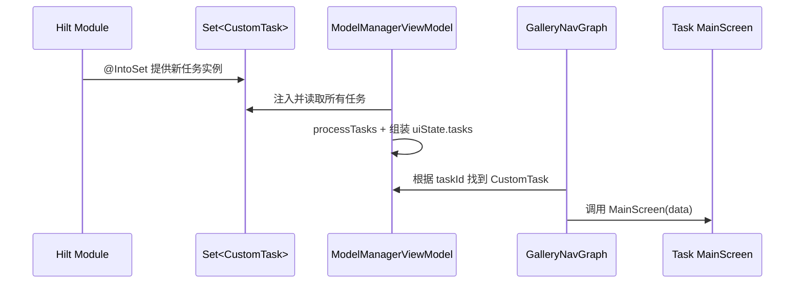
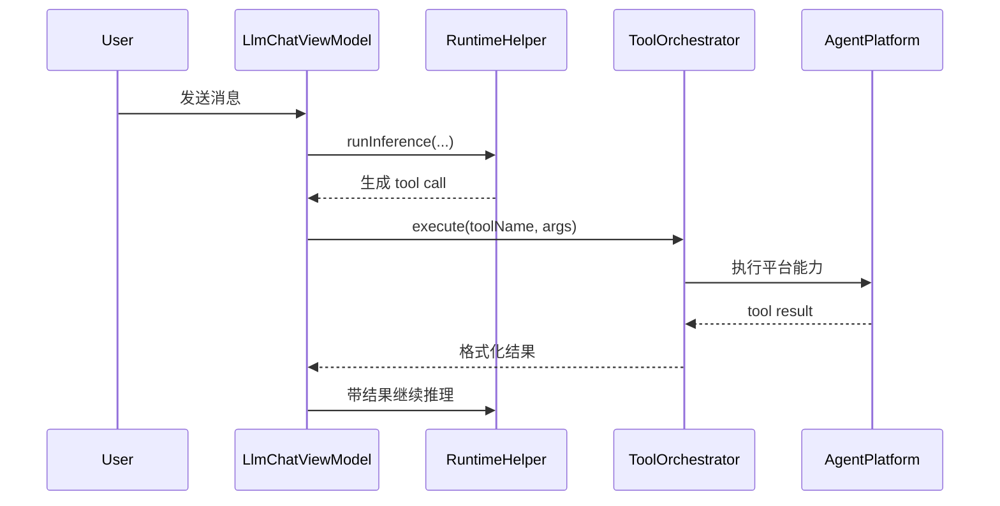

# Android 核心架构 05：任务扩展层

## 这章讲什么

任务扩展层像“乐高接口”：

- 你做一个新任务（新积木）。
- 按 `CustomTask` 这套标准插口做。
- App 就能自动识别并显示这个任务。

---

## 架构图（任务插件机制）

```mermaid
flowchart TD
    A[CustomTask 接口] --> B[AgentChatTask]
    A --> C[MobileActionsTask]
    A --> D[TinyGardenTask]
    A --> E[ExampleCustomTask]
    A --> F[LlmChatTask/LlmSingleTurnTask]

    B --> G[@IntoSet 注册]
    C --> G
    D --> G
    E --> G
    F --> G

    G --> H[ModelManagerViewModel 注入 Set<CustomTask>]
    H --> I[导航到任务 MainScreen]
```

---

## 关键代码细节（函数级）

## 1) `CustomTask` 契约长什么样

接口要求每个任务必须实现：

- `val task: Task`
- `initializeModelFn(...)`
- `cleanUpModelFn(...)`
- `@Composable fun MainScreen(data: Any)`

其中 `task` 决定首页卡片显示信息，`MainScreen` 决定进入任务页后看到什么 UI。

---

## 2) 注册机制：`@IntoSet`

例如 `AgentChatTaskModule`：

- `@Provides`
- `@IntoSet`
- `fun provideTask(): CustomTask = AgentChatTask()`

这会把任务加入 `Set<CustomTask>`。  
`ModelManagerViewModel` 直接注入这个集合，不需要硬编码任务列表。

---

## 3) AgentChatTask 的实细节

`initializeModelFn(...)` 里做了这些实动作：

1. 并行加载 skills（`skillManagerViewModel.loadSkills()`）和 MCP servers。
2. 根据 MCP 是否启用，选择系统提示词模板（skills-only 或 skills+tools）。
3. 用 `injectSkillsAndMcpTools(...)` 把 skills 描述和工具 schema 填进 prompt。
4. 调 `LlmChatModelHelper.initialize(...)`，并注入 `tool(agentTools)`。

`AgentTools.kt` 里还定义了真正工具：

- `loadSkill`
- `runMcpTool`
- `runJs`
- `runIntent`

不是“说支持工具”，而是有明确函数。

---

## 4) MobileActionsTask 的实细节

`MobileActionsTask` 使用：

- `MobileActionsTools(onFunctionCalled = { curActions.add(it) })`

也就是说：模型触发 function call 后，会变成 `Action` 对象进队列，UI 再执行。  
系统提示词 `getSystemPrompt()` 还会注入当前日期和星期，帮助模型理解“今天”“明天”这类话。

---

## 5) TinyGardenTask 的实细节

`TinyGardenTask` 的 `SYSTEM_PROMPT` 明确写了：

- 3x3 地块编号规则
- seed 类型
- “top row/middle row”映射

工具调用后通过 `_updateChannel` 往 UI 发 `TinyGardenCommand`，是一个真实事件流，不是死文本。

---

## 6) ExampleCustomTask 的教学价值

演示了 2 种模型来源：

1. 本地手动放文件（`localFileRelativeDirPathOverride`）
2. 网络下载模型文件（`url + downloadFileName`）

并在 `initializeModelFn` 里读取文件内容、按配置截断文本、构造 `model.instance`。

---

## 流程图（新任务如何被系统识别）



---

## 一个真实小例子（用户新增 Skill 后对话行为变化）

在 Agent Chat 里：

1. 用户勾选了新 Skill。
2. `resetSessionWithCurrentSkillsAndMcps(...)` 会重新构建 system prompt。
3. prompt 里出现新 skill 的 name/description。
4. 模型下一轮推理就能调用 `loadSkill` -> `runJs/runIntent/runMcpTool`。

所以“新增 skill 能立刻生效”背后有明确的重置会话逻辑，不是玄学。

---

## 深入代码：CustomTask 生命周期表（输入/输出/副作用）

| 阶段 | 核心函数 | 输入 | 输出 | 副作用 |
| --- | --- | --- | --- | --- |
| 发现 | `provideTask()/provideCustomTasks()` | Hilt 注入上下文 | `Set<CustomTask>` | 任务被注册进全局集合 |
| 可用性判断 | `isAvailable(context)`（若任务实现） | 设备能力、权限、系统版本 | `Boolean` | 决定任务是否出现在首页 |
| 配置加载 | `setCustomTaskData(data)` | 模型参数、开关 | 内部状态更新 | 影响运行时 prompt/工具 |
| 运行时接入 | `toTask()/toModel()` | CustomTask 描述 | 标准 `Task/Model` | 进入统一导航与推理链路 |

---

## 深入代码：AgentTools 调用链（点一次工具到底走哪）



---

## 深入代码：权限与能力分支矩阵（Mobile Actions）

| 条件 | 分支 | 用户看到什么 |
| --- | --- | --- |
| 权限已授权 + 服务可用 | 正常启用 | 可直接执行动作 |
| 权限未授权 | 引导授权 | 任务可见，但先走授权流程 |
| 服务不可用/版本不支持 | 不可用 | 任务隐藏或显示不支持提示 |

---

## 排障提示（扩展层）

1. **自定义任务不显示**：先看 `@IntoSet` 是否注入成功，再看 `isAvailable()`。  
2. **点了任务进不去页面**：检查 `toTask()/toModel()` 是否给出有效 `taskName/modelId`。  
3. **工具调用卡住**：看 ToolOrchestrator 是否收到 tool result；没结果就不会进入下一轮推理。  
