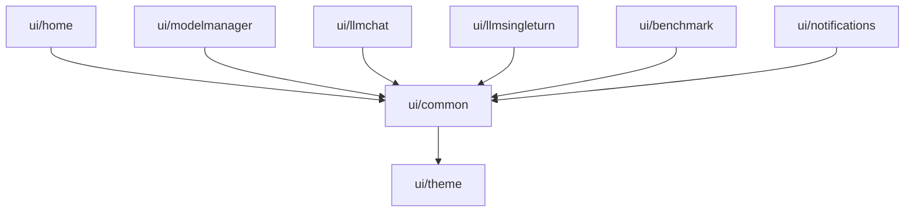
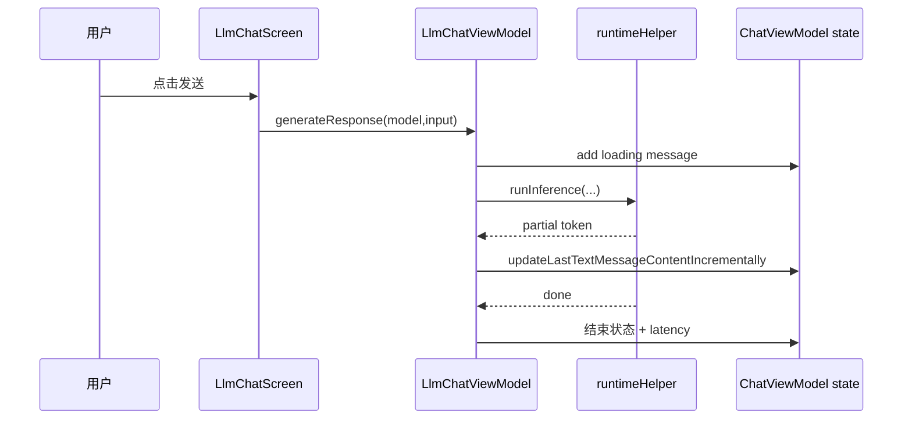
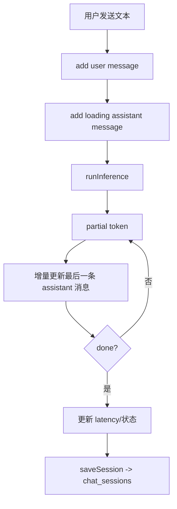

# Android 核心架构 06：UI 组件层

## 这章讲什么

UI 层就是“看得见、点得到”的所有东西：

- 首页卡片
- 模型列表
- 聊天气泡
- 语音按钮
- 设置弹窗

但它不是乱画页面，而是按模块分好工。

---

## 架构图（页面层 + 通用组件层）

---

## 关键代码细节（函数级）

## 1) 首页 `HomeScreen(...)`

它不是只画卡片，实际还做了很多逻辑：

- 读 `modelManagerViewModel.uiState`。
- 当 `loadingModelAllowlist` 为 true 时，显示延迟 loading（避免闪烁）。
- 分类页签来自 `uiState.tasksByCategory`。
- 点击任务卡触发 `navigateToTaskScreen(task)`。
- 管理 ToS 弹窗、SettingsDialog、通知权限请求。

---

## 2) 聊天状态底座 `ChatViewModel`

`ChatViewModel.kt` 管理聊天消息总状态：

- `messagesByModel`：每个模型一条独立聊天记录
- `addMessage(...)`
- `updateLastTextMessageContentIncrementally(...)`
- `updateLastThinkingMessageContentIncrementally(...)`
- `saveSession(...)` 把聊天落到 `chat_sessions`
- `deleteSession(...)` / `clearAllSessions(...)`

这就是“切换模型后聊天互不干扰”的根因。

---

## 3) 多轮聊天 `LlmChatViewModel`

`generateResponse(...)` 的核心动作：

1. 等待 `model.instance` 完成初始化。
2. 先插入 loading 消息。
3. 调 `model.runtimeHelper.runInference(...)`。
4. 流式 token 回来时更新最后一条消息。
5. done 后写 latency，收尾状态。

`applySystemPromptChange(...)` 还会：

- 保存新提示词
- 触发 reset session
- 插入“System prompt updated”提示消息

---

## 4) Prompt Lab `LlmSingleTurnViewModel`

与多轮聊天不同，它每次都：

- 先 `resetConversation(...)`
- 再做一次 single-turn 推理
- 把结果按模板类型存到 `responsesByModel[model][template]`

适合做“单次指令测试”。

---

## 5) Benchmark 页面

`BenchmarkViewModel.runBenchmark(...)`：

- LiteRT 路径：调用 benchmark API，循环 runCount 次
- AICore 路径：直接 runInference 并统计 token 输出速度
- 结果写入 `BenchmarkResult` 并持久化到 DataStore

---

## 流程图（聊天页面一次发消息）

---

## 一个真实小例子（为什么切模型不会串聊天）

原因在 `ChatViewModel` 的数据结构：

- `messagesByModel: Map<String, MutableList<ChatMessage>>`

key 是 `model.name`。  
所以：

- Gemma 的消息存一份
- 另一个模型再存一份

切换模型只是换 key，不会拿错列表。

---

## 深入代码：UI 状态“谁改、何时改”清单

| 状态 | 修改函数 | 触发时机 |
| --- | --- | --- |
| 输入发送中 | `LlmChatViewModel.generateResponse` | 用户点击发送后立刻 |
| 最后一条文本消息 | `updateLastTextMessageContentIncrementally` | 每次收到 token |
| thinking 消息 | `updateLastThinkingMessageContentIncrementally` | 模型返回 reasoning chunk |
| 会话持久化 | `saveSession` | 用户触发保存或页面生命周期触发 |
| 当前选中 session | `setCurrentSessionName` | 用户切换历史会话 |

---

## 深入代码：聊天消息生命周期（从创建到落盘）

---

## 深入代码：UI 不卡顿的两个关键点

1. 首页 loading 采用“延迟显示”，短加载不闪屏。  
2. 聊天区用“增量更新最后一条消息”，不是每个 token 新建一条消息。  

---

## 排障提示（UI 层）

1. **消息不刷新**：优先看是否走到了 `updateLastTextMessageContentIncrementally`。  
2. **切会话后内容错乱**：检查 `currentSessionName` 与 `messagesByModel` 的 key 是否一致。  
3. **首页一直 loading**：检查 `loadingModelAllowlist` 与延迟 loading 状态是否正确归零。  
