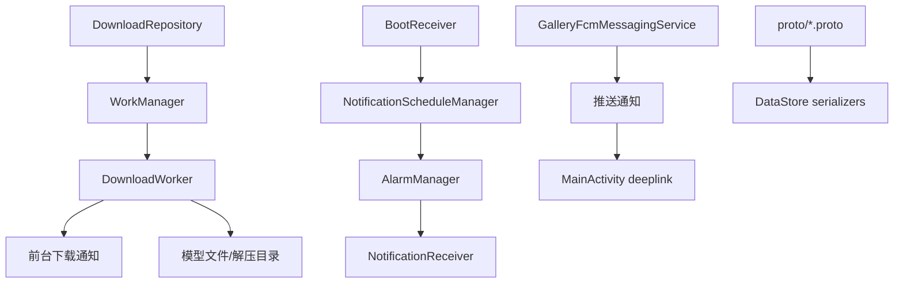
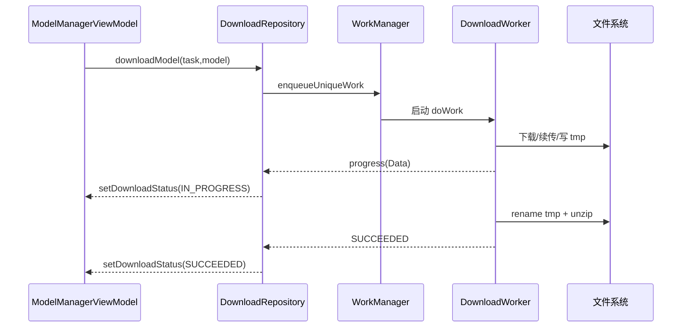
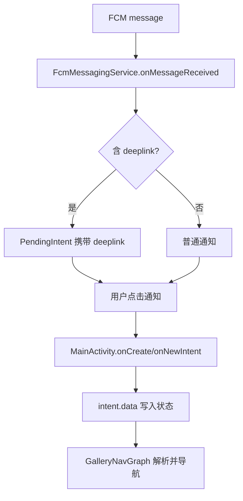

# Android 核心架构 07：系统能力与后台模块

## 这章讲什么

如果前台页面是“教室”，那这章是“后勤部门”：

- 下载员：后台下载大模型
- 通知员：定时提醒、推送提醒
- 档案员：把数据写到 proto 文件
- 门卫：开机后把提醒重新挂上

---

## 架构图（后台模块关系）

---

## 关键代码细节（函数级）

## 1) 下载链路：`DownloadRepository -> DownloadWorker`

`DefaultDownloadRepository.downloadModel(...)` 具体动作：

1. 组 `inputData`（模型 URL、版本、文件名、额外数据 URL、token）。
2. 建 `OneTimeWorkRequestBuilder<DownloadWorker>()`。
3. `enqueueUniqueWork(model.name, REPLACE, request)`。
4. `observerWorkerProgress(...)` 监听状态：
   - ENQUEUED/RUNNING/SUCCEEDED/FAILED/CANCELLED
5. 更新 `ModelDownloadStatus` 并通知 UI。

---

## 2) Worker 下载实逻辑

`DownloadWorker.doWork()` 里做了真实下载细节：

- 如果 tmp 文件存在，设置 HTTP `Range` 续传
- 每 200ms 上报进度（已下载字节、速率、剩余时间）
- 下载结束后把 `*.tmp` 改名为正式文件
- 如果 `isZip=true`，解压到 `unzippedDir` 并删 zip

这不是“下载一下”，是有断点续传和解压流程的。

---

## 3) 定时通知系统

`NotificationScheduleManager.scheduleNotification(...)`：

- 先 `setAlarmForNotification(...)`
- 成功后写入 `_scheduledNotifications`
- 再 `saveNotifications()` 到 `scheduled_notifications.pb`

`setAlarmForNotification(...)` 支持：

- 指定年月日 + 时分
- 仅时分（自动当天/明天）
- `repeatDaily` 每天重复

---

## 4) 推送通知系统（FCM）

`GalleryFcmMessagingService.onMessageReceived(...)`：

- 读取 `data["deeplink"]`、`data["image_url"]`、`title/body`
- `sendNotification(...)` 里创建 channel + PendingIntent
- deeplink 存在时，点击通知直接按 deeplink 打开对应页面

---

## 5) 开机恢复

`BootReceiver.onReceive(...)` 监听 `ACTION_BOOT_COMPLETED`：

- 通过 Hilt entry point 拿到 `NotificationScheduleManager`
- 调 `rescheduleAllNotifications()`

这样手机重启后，之前的提醒不会丢。

---

## 6) Manifest 中的关键接线

`AndroidManifest.xml` 里有这些硬连接：

- `androidx.work.impl.foreground.SystemForegroundService`
- `.GalleryFcmMessagingService` + `com.google.firebase.MESSAGING_EVENT`
- `notifications.NotificationReceiver`
- `notifications.BootReceiver` + `BOOT_COMPLETED`
- 深链 `scheme="com.google.ai.edge.gallery"`

权限也明确声明了：

- `FOREGROUND_SERVICE_DATA_SYNC`
- `POST_NOTIFICATIONS`
- `RECEIVE_BOOT_COMPLETED`
- `INTERNET`

---

## 流程图（模型下载全流程）

---

## 一个真实小例子（为什么通知点击能直达模型页）

链路是这样的：

1. `DownloadRepository.sendNotification(...)` 里拼 deeplink：  
   `com.google.ai.edge.gallery://model/$taskId/$modelName`
2. 通知点击后进入 `MainActivity`。
3. `MainActivity` 把 deeplink 写进 `intent.data`。
4. `GalleryNavGraph` 解析 `intent.data`，跳到 `route_model/{taskId}/{modelName}`。

所以“下载完成通知 -> 点一下直达模型页”是完整打通的。

---

## 深入代码：DownloadWorker 状态与失败处理

| 阶段 | 关键动作 | 失败后行为 |
| --- | --- | --- |
| 准备阶段 | 读取 inputData、创建 tmp 文件 | `Result.failure()`，状态置 FAILED |
| 下载阶段 | HTTP 请求 + Range 续传 + 进度上报 | 记录错误，保留可续传 tmp |
| 收尾阶段 | tmp rename 正式文件 | rename 失败则失败并保留上下文 |
| 解压阶段 | unzip 到目标目录并删 zip | 解压失败置 FAILED，避免伪成功 |

---

## 深入代码：通知调度规则表（一次性/重复）

| 类型 | 触发条件 | 调度方式 | 过期策略 |
| --- | --- | --- | --- |
| 一次性（指定日期） | 到达具体年月日时分 | `AlarmManager` 单次闹钟 | 过期后删除记录 |
| 一次性（仅时分） | 当天未过点用当天，过点用明天 | 动态算最近一次时间 | 触发后删除记录 |
| 每日重复 | `repeatDaily=true` | 每次触发后重排下一天 | 长期保留直到用户取消 |

---

## 补充流程图：FCM 到页面跳转全链路

---

## Manifest 接线检查清单（排错时按这个看）

1. `DownloadWorker` 对应 WorkManager 依赖和前台服务权限是否都在。  
2. `GalleryFcmMessagingService` 是否声明了 `com.google.firebase.MESSAGING_EVENT`。  
3. `NotificationReceiver`、`BootReceiver` 是否在 manifest 注册且 exported 设置符合系统要求。  
4. deeplink scheme 是否与代码里生成的 URI 完全一致（`com.google.ai.edge.gallery`）。  

---

## 排障提示（系统与后台）

1. **下载完成但 UI 没更新**：先看 WorkInfo 是否 SUCCEEDED，再看 ViewModel 是否收到 observer 回调。  
2. **重启后通知消失**：检查 `BootReceiver` 是否触发，以及 `rescheduleAllNotifications()` 是否读取到持久化数据。  
3. **推送点击不跳转**：优先核对通知里 deeplink 格式与导航路由参数是否匹配。  
