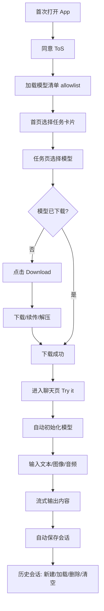
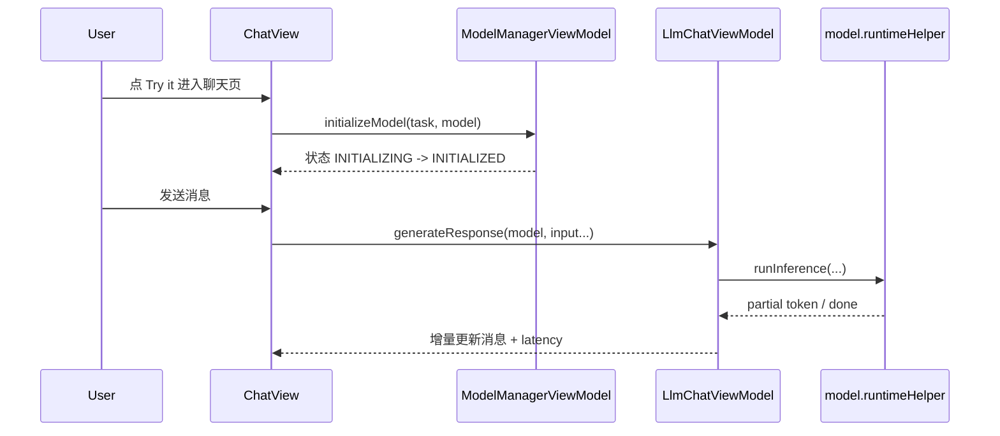

# Android 首次使用全流程实操说明（从 0 到可持续对话）

> 这篇不是架构拆解，而是站在**第一次用 App 的用户**视角，完整走一遍：  
> **首次打开 -> 选任务 -> 选模型 -> 下载模型 -> 进入对话 -> 生成内容 -> 管理会话**。

---

## 1. 一图看完整流程（用户视角）

---

## 2. 第一次打开：会发生什么

### 2.1 你看到的操作
1. 第一次进 App，会先弹 ToS。  
2. 你同意后，才会进入首页任务卡片列表。  
3. 首页可能短暂显示“Loading model list”。

### 2.2 代码里实际怎么做
- ToS 控制：`HomeScreen.kt`  
  - `showTosDialog = !tosViewModel.getIsTosAccepted()`  
  - `onTosAccepted -> tosViewModel.acceptTos()`
- 模型清单加载态：`uiState.loadingModelAllowlist`（200ms 防闪烁延迟显示）
- 失败重试：`loadingModelAllowlistError` 弹窗里直接 `Retry -> loadModelAllowlist()`

---

## 3. 选择任务：从首页进入能力页面

### 3.1 你看到的操作
1. 首页看到多个任务卡片（聊天、图像、音频、Agent 等）。  
2. 点击任意卡片，进入该任务的模型列表。

### 3.2 代码里实际怎么做
- 首页点击：`HomeScreen.kt` 的 `navigateToTaskScreen(task)`  
- 任务与模型来源：`ModelManagerViewModel.loadModelAllowlist()`  
  - allowlist JSON -> `AllowedModel.toModel()` -> 按 `taskTypes` 挂到各任务。

---

## 4. 选择模型与下载模型（首次最关键步骤）

## 4.1 你看到的操作
1. 进入任务页后，每个模型卡片有 `Download` 或 `Try it`。  
2. 未下载时点 `Download`，看到进度条和百分比。  
3. 可中途取消。  
4. 下载完成后按钮变为 `Try it`。

## 4.2 代码里实际怎么做（入口）
- 按钮逻辑：`DownloadAndTryButton.kt`  
  - `needToDownloadFirst = NOT_DOWNLOADED/FAILED 且非本地 override 且非 AICORE`
  - 下载中显示进度；可点关闭图标触发 `cancelDownloadModel()`
- ViewModel 入口：`ModelManagerViewModel.downloadModel(task, model)`
  - AICore：走 `AICoreModelHelper.downloadModel(...)`
  - LiteRT：走 `DownloadRepository.downloadModel(...)`

## 4.3 HuggingFace gated 模型分支（真实用户经常遇到）
- 文件：`DownloadAndTryButton.kt`
1. 先探测 URL 是否需要鉴权。  
2. 需要鉴权时检查 token（未存储/过期/有效）。  
3. 必要时发起登录换 token。  
4. 若 403，弹“用户协议确认”sheet，引导打开协议页后再继续下载。

## 4.4 下载执行细节（后台）
- `DefaultDownloadRepository.downloadModel(...)`
  - 组装 `WorkRequest` 输入参数（URL、commit、fileName、extraData、token）
  - `enqueueUniqueWork(model.name, REPLACE, request)`
  - 监听 `WorkInfo` 状态回传 UI
- `DownloadWorker.doWork()`
  - 前台服务通知保活
  - `*.tmp` + HTTP `Range` 断点续传
  - 每 200ms 上报下载进度/速率/剩余时间
  - zip 模型自动解压并切 `UNZIPPING`

---

## 5. 使用模型（Try it 后到第一条回复）

## 5.1 你看到的操作
1. 点击 `Try it` 进入聊天页。  
2. 首次会显示模型初始化加载。  
3. 输入文本（或图像/音频）并发送。  
4. 回复按流式逐字出现，可中途点 Stop。

## 5.2 代码里实际怎么做（关键链路）

核心文件：
- 初始化触发：`ChatView.kt`（下载成功后 `LaunchedEffect` 调 `initializeModel`）
- 初始化执行：`ModelManagerViewModel.initializeModel(...)`
- 推理执行：`LlmChatViewModel.generateResponse(...)`
- 停止生成：`LlmChatViewModel.stopResponse(...) -> model.runtimeHelper.stopResponse(...)`

---

## 6. 内容输出：用户最终会看到哪些“结果形态”

系统不是只支持纯文本，输出类型在 `ChatMessage.kt` 有明确定义：
- `TEXT`：文本回复（默认 Markdown 渲染）
- `THINKING`：思考过程块（若模型与任务开启）
- `IMAGE` / `IMAGE_WITH_HISTORY`：图像结果
- `AUDIO_CLIP`：音频片段
- `INFO/WARNING/ERROR`：系统提示与错误信息
- `COLLAPSABLE_PROGRESS_PANEL`：任务进度块

展示层对应：
- 文本渲染：`MessageBodyText.kt`
  - `isMarkdown=true` -> `BufferedFadingMarkdownText`
  - `isMarkdown=false` -> 普通 `Text + SelectionContainer`
- agent 文本可复制；图片可查看/分享/复制/保存（`ChatView.kt` 图像查看器）

---

## 7. 会话管理（可持续使用的核心）

## 7.1 用户能做的事
1. 自动保存当前会话。  
2. 打开历史列表，加载旧会话。  
3. 新建会话。  
4. 删除单条会话。  
5. 清空所有会话。

## 7.2 代码里实际怎么做
- 自动保存触发：`ChatView.kt`
  - 当 `uiState.inProgress` 变为 false 且当前有消息 -> `saveSession(...)`
- 存储结构：`ChatViewModel.saveSession(...)`
  - 消息转 `ChatSessionProto`（包含 title、timestamp、taskId、originalModel、messages）
  - 图像/音频会写缓存文件并记录路径，避免会话丢媒体
- 历史 UI：`ChatHistorySideSheet.kt`
  - `+ New chat`、加载、删除、`Clear all`
- 加载旧会话：`ChatView.kt`
  - 反序列化 proto 消息 -> 清空当前消息 -> 回填消息 -> `resetSession(clearHistory=false)`

---

## 8. 常见实际问题（按操作点排查）

1. **首页一直空白或没任务**  
看 `loadingModelAllowlistError` 是否出现；重试会重新走 `loadModelAllowlist()`。

2. **点击 Download 没开始**  
先看是否在 token 检查流程（按钮会显示 `checking access`）；再看是否触发了内存警告或 Gemma ToU 弹窗。

3. **下载到一半失败**  
Worker 会落 `FAILED`，再次点击 Download 会从 tmp 续传（若服务器支持 Range）。

4. **点 Try it 后一直不能发消息**  
看是否仍在 `INITIALIZING`；聊天页下载成功后会自动触发 `initializeModel`。

5. **历史会话加载后上下文不一致**  
加载历史会话后会调用 `resetSession(initialMessages=...)`，会话 ID 切换为历史 sessionId；新建会话会生成新 UUID。

---

## 9. 给第一次上手用户的最短路径（30 秒版）

1. 同意 ToS。  
2. 首页点一个任务（建议 LLM Chat）。  
3. 选一个模型，点 `Download`，等到 `Try it`。  
4. 点 `Try it` 进聊天页，输入一句话发送。  
5. 回答出来后，点右上角历史按钮可看到会话已自动保存。  
